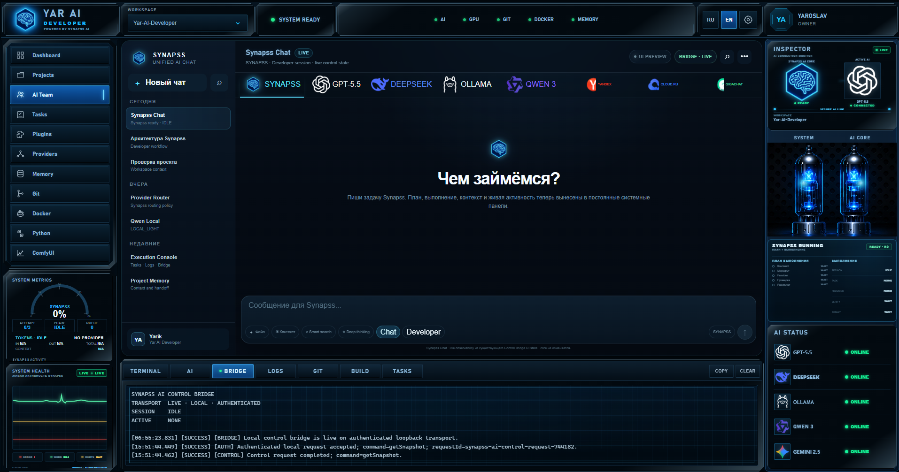

# Yar AI Developer — Portfolio Showcase

**Yar AI Developer** is a Windows desktop project focused on AI-assisted software development.

The full working repository remains private. This public portfolio view contains only safe-to-share information and one representative screenshot of the current interface.



## What the project explores

- desktop AI-assisted development workflows;
- multiple AI-provider integration;
- local LLM workflows with Ollama;
- REST API / JSON communication;
- project-context loading;
- bounded file operations;
- verification and fail-closed execution;
- Git-oriented development workflows;
- logging and diagnostics;
- browser/UI automation;
- SHA-256 integrity checks.

## High-level architecture

```text
UI
↓
AI Manager
↓
AI Router
↓
AI Providers
↓
Execution Engine
↓
Plugin / Tool Layer
↓
Operating System
```

## Technology

TypeScript, JavaScript, HTML, CSS, Vite, Tauri, Rust, PowerShell, Git, REST API, JSON, Ollama and AI provider APIs.

## AI-assisted development approach

```text
Task
→ decomposition
→ architecture / constraints
→ AI-assisted implementation
→ run
→ inspect error
→ identify root cause
→ targeted correction
→ test
→ verify real postconditions
→ record the lesson
```

I do not treat the first AI-generated answer as the final result. The goal is a working, verified implementation that I can explain and reproduce.

Examples of engineering problems handled during development include browser submission verification, stale file hashes, runtime/build-path mistakes, PowerShell 5.1 compatibility and download automation.

## Project status

Yar AI Developer is an **active work in progress**. The screenshot above is representative of the current UI; individual modules and workflows continue to evolve.

## Author

**Yaroslav** — AI-assisted development / AI automation / rapid prototyping
