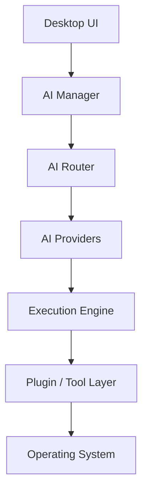

# Architecture Overview

This document describes the public, high-level architecture of Yar AI Developer.

## Layers

### Desktop UI

The user-facing layer for projects, tasks, provider selection, status, logs and execution feedback.

### AI Manager

Coordinates AI-oriented work and prepares the context required for a task.

### AI Router

Selects an appropriate provider/model path according to the task and available capabilities.

### AI Providers

Cloud and local model adapters are kept behind provider-specific boundaries so that the rest of the application does not depend on one model vendor.

### Execution Engine

Receives bounded, structured developer actions rather than giving a model unrestricted operating-system authority.

### Plugin / Tool Layer

Provides integrations such as files, Git, local development tools and other project utilities.

## Design principles

- separate proposal generation from execution authority;
- verify important preconditions before mutation;
- use bounded actions instead of unrestricted shell access;
- keep model/provider failures isolated from unrelated system layers;
- verify real postconditions after an action;
- preserve enough diagnostics to reproduce failures.

This public document intentionally omits private transport details, local paths, credentials and internal operational configuration.
